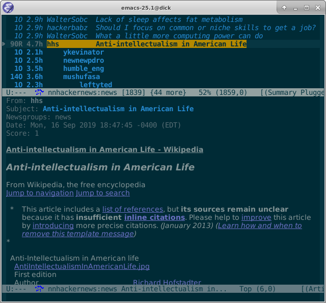

|build-status|

  Procrastination can be a full-time job.

.. COMMENTARY (see Makefile)

.. |build-status|
   image:: https://travis-ci.com/dickmao/nnhackernews.svg?branch=master
   :target: https://travis-ci.com/dickmao/nnhackernews
   :alt: Build Status
.. |melpa-dev|
   image:: https://melpa.org/packages/nnhackernews-badge.svg
   :target: http://melpa.org/#/nnhackernews
   :alt: MELPA current version
.. |melpa-stable|
   image:: http://melpa-stable.milkbox.net/packages/ein-badge.svg
   :target: http://melpa-stable.milkbox.net/#/ein
   :alt: MELPA stable version

Install
=======
As described in `Getting started`_, ensure melpa's whereabouts in ``init.el`` or ``.emacs``::

   (add-to-list 'package-archives '("melpa" . "https://melpa.org/packages/"))

Then

::

   M-x package-refresh-contents RET
   M-x package-install RET nnhackernews RET

Alternatively, copy ``nnhackernews.el`` to a directory among ``C-h v RET load-path`` and add ``(require 'nnhackernews)`` to ``.emacs``.

Usage
=====
In your ``.gnus`` or ``.emacs``,

::

   (add-to-list 'gnus-secondary-select-methods
                '(nnhackernews ""))

Enter the ``nnhackernews:news`` newsgroup with ``RET``.

Gnus will only show followup comments for threads you read, so be selective.  If you accidentally read a thread, or decide the thread is uninteresting, you may ``C-k`` it to prevent Gnus from showing followups.  Use ``C-k`` liberally.

The signal-to-noise of the hackernews firehose is such that I often "catch-up" via ``c`` to flush the unread threads.

Create a post via ``a``.

Reply to articles with ``f`` or ``r``.  Include original with ``F``.

Vote articles by ``R =`` (up), or ``R 0`` (retract).

From the ``*Group*`` buffer, press ``g`` to refresh all groups.  ``M-g`` on a particular group to refresh individually.

From the summary buffer, ``/o`` redisplays articles already read.  ``x`` undisplays them.

``S c`` cancels articles.

Gnus beginners may find the interface bewildering.  In particular, groups with no unread articles do not display.  Use ``L`` to bring them out of hiding.

.. _Getting started: http://melpa.org/#/getting-started
